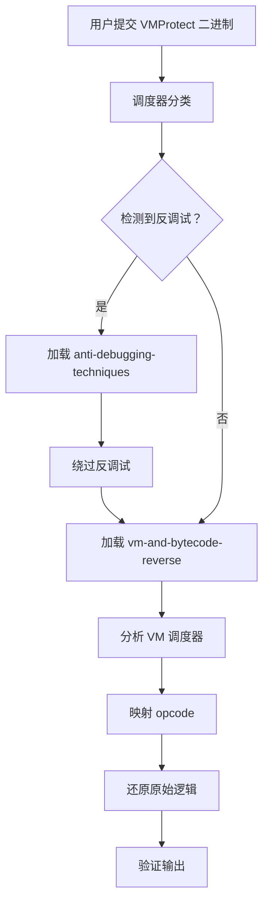
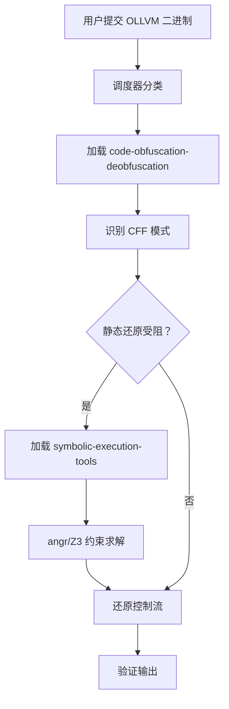

# 跨 Skill 协作

现实中的混淆方案往往是多层次的 — 一个二进制可能同时使用 VM 保护、反调试和代码混淆。deobf-all 的路由机制会自动组合多个子 skill 协同应对。

## 常见协作场景

| 场景 | 主 Skill | 辅助 Skill | 说明 |
|------|---------|------------|------|
| VMProtect + 反调试 | `vm-and-bytecode-reverse` | `anti-debugging-techniques`、`code-obfuscation-deobfuscation` | 先绕过反调试，再分析 VM |
| OLLVM CFF 二进制 | `code-obfuscation-deobfuscation` | `symbolic-execution-tools` | 静态还原 CFF，约束求解辅助 |
| 加壳 + 反逆向 | `code-obfuscation-deobfuscation` | `anti-reversing-techniques`、`binary-protection-bypass` | 绕过保护机制再脱壳 |
| 重度 JS 混淆 | `ast-deobfuscation` | `code-obfuscation-deobfuscation` | AST 处理 JS 特有模式，通用 deobf 兜底 |
| CTF 逆向 pwn 题 | `ctf-reverse` | `deep-analysis`、所有相关子 skill | CTF 方法论引导分析方向 |
| 未知保护器 | `deep-analysis` | `code-obfuscation-deobfuscation` | 先分类，再针对性处理 |

## 协作流程示例

### VMProtect + 反调试二进制

### OLLVM 控制流扁平化

## 最佳实践

1. **信任路由** — 让调度器自动选择 skill 组合，不要手动跳过分类步骤
2. **分步验证** — 每完成一个层级的反混淆后，先验证再进入下一层级
3. **注意嵌套保护** — 某些混淆器会堆叠使用（如 VMProtect + Themida），需要逐层剥离
4. **优先静态** — 静态方法通常更快、更可复现；仅在静态受阻时切换为动态策略
