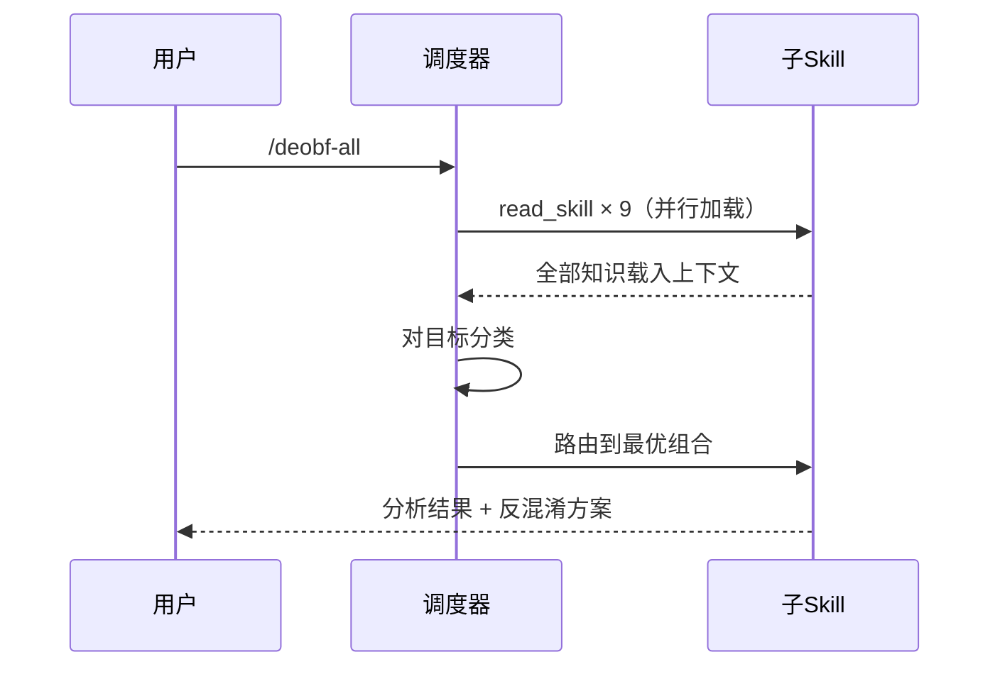

# 工作原理

deobf-all 作为调度器（Dispatcher），在激活时会执行以下流程：

## 激活流程

## 四步工作流

### Step 1: 分类（Triage）

始终执行的第一步：

- 识别目标类型：原生二进制、JavaScript、字节码、其他
- 识别混淆家族：CFF、VM、字符串加密、加壳、JS 混淆器（obfuscator.io、JSFuck 等）
- 检查是否有反调试/反逆向层
- **输出**：分类摘要 + 推荐的子 skill 组合

### Step 2: 加载与应用（Load & Apply）

根据分类结果应用相关子 skill 知识：

- **JavaScript**：运行 `scripts/detect-patterns.js`（来自 ast-deobfuscation）识别站点/框架
- **原生二进制**：识别保护器类型（VMProtect / Themida / OLLVM / 自定义）

### Step 3: 反混淆（Deobfuscate）

- 优先使用静态反混淆（模式匹配、CFF 还原、字符串解密）
- 如受阻，切换为动态策略（调试器脚本、仿真、符号执行）
- 当手动分析停滞时，使用 symbolic-execution-tools 进行自动约束求解

### Step 4: 验证（Validate）

- 将反混淆输出与原始特征对比
- 验证反混淆后的代码功能等价
- 检查是否有残余混淆层（嵌套/堆叠保护器）
